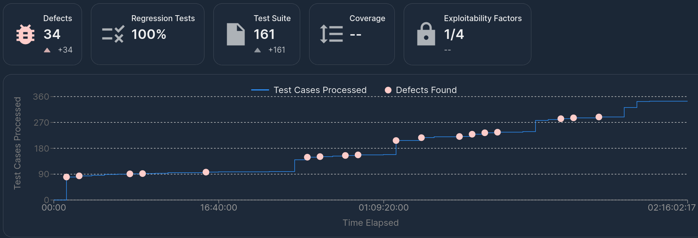
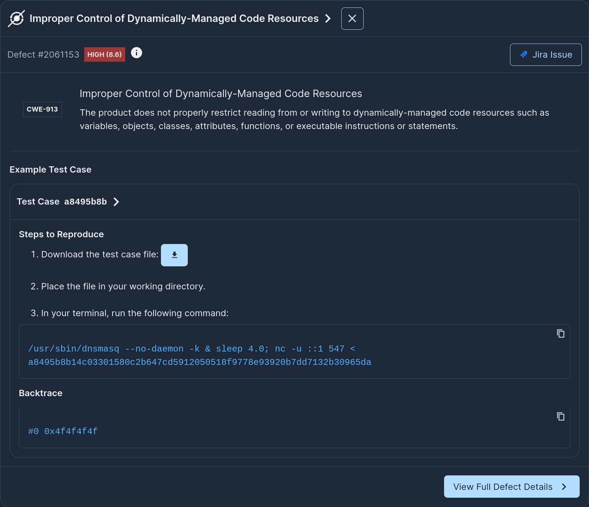
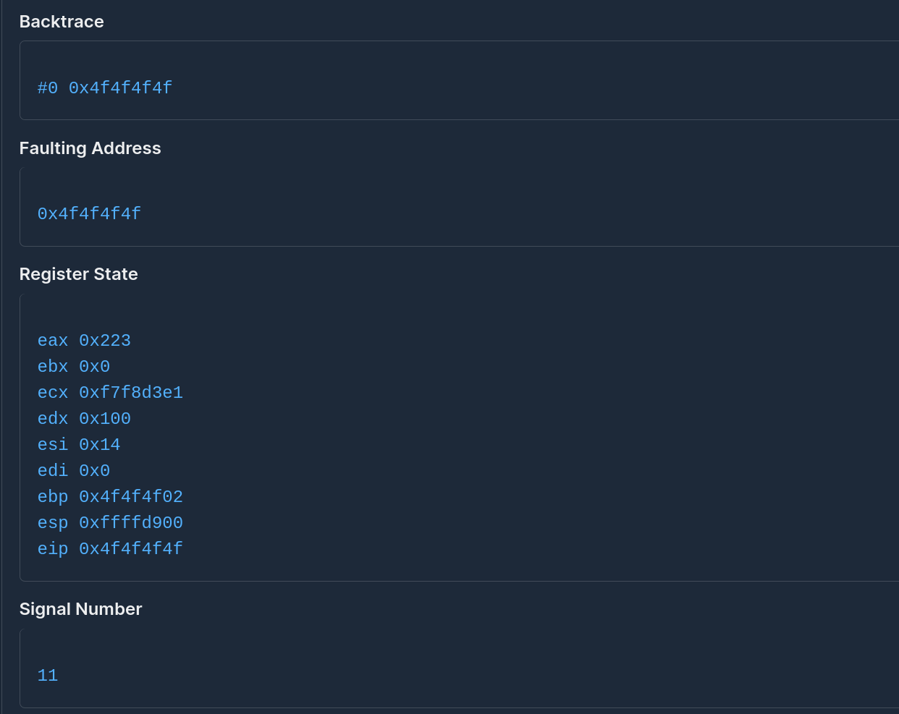

<p align="center"></p>

# Testing IoTGoat's dnsmasq with Mayhem

The [IoTGoat project](https://github.com/OWASP/IoTGoat/) is a deliberately insecure firmware based on [OpenWrt](https://openwrt.org/) and maintained by [OWASP](http://owasp.org/) as a platform to educate software developers and security professionals with testing commonly found vulnerabilities in IoT devices. The vulnerability challenges are based on the OWASP IoT Top 10, as well as "easter eggs" from project contributors. For a list of vulnerability challenges, see the [IoTGoat challenges wiki](https://github.com/OWASP/IoTGoat/wiki/IoTGoat-challenges) page. In this write up, we will be trying out the [binary runtime analysis section](https://github.com/OWASP/IoTGoat/wiki/Dnsmasq-exercise-setup) of the challenge and assess how easy it is to find vulnerabilities in it.

## Getting started

There are a few suggested ways to get started with trying out IoTGoat, including: (1) downloading the raw firmware package, (2) downloading a custom virtual machine, or (3) building from source. In this write up, we'll skip on custom build instructions and we will be testing out IoTGoat using the raw firmware package package as downloaded from the [releases page](https://github.com/OWASP/IoTGoat/releases).

## Extracting and Dockerizing our target: dnsmasq

[Dnsmasq](https://en.wikipedia.org/wiki/Dnsmasq) is a popular open-source lightweight DNS forwarder and DHCP server used in IoTGoat's firmware. The installed Dnsmasq package (version 2.73) is vulnerable to a stack-based buffer overflow when using the DHCPv6 service - [CVE-2017-14493](https://cve.mitre.org/cgi-bin/cvename.cgi?name=CVE-2017-14493), see also [Google Security's blog post](https://security.googleblog.com/2017/10/behind-masq-yet-more-dns-and-dhcp.html) for a few more details on the vulnerability.

So, in theory, all we have to do is setup an automatic testing campaign against dnsmasq's DHCP service. If that binary was already in a runnable docker image we would be done since Mayhem can take these in with zero effort. However, in this particular case, the dnsmasq target is embedded in the released firmware package, a problem quite common when trying to analyze IoT firmware.

Luckily, there are excellent firmware extraction/rehosting systems, including [Binwalk](https://github.com/ReFirmLabs/binwalk), [Firmadyne](https://github.com/firmadyne/firmadyne) or the more recent [Greenhouse](https://github.com/sefcom/greenhouse). Let's try them out and see if we can auto-extract the IoTGoat firmware. Our goal: autodockerize the IoTGoat target so that it's runnable by Mayhem.

We decided to use the simplest of the tools above for extraction to limit the "magic" done behind the scenes. We put together a 10-line python extractor:

```python
def main():
    with tempfile.TemporaryDirectory() as tmpdirname:
        os.chdir(tmpdirname)
        subprocess.check_output(["binwalk", "-e", "-M", "-0", "root", "/input"])
        # look for the following directory: "/etc" and copy "/" to "/output"
        for root, dirs, files in os.walk(tmpdirname):
            if "etc" in dirs:
                subprocess.check_output(["cp", "-ra", os.path.join(root, '.'), "/output"])
                break
    with open("/output/Dockerfile", "w") as f:
        f.write("FROM scratch\n")
        f.write("COPY . /\n")
```

and planted it in an iot-dockerizer image to have a complete tool doing the dockerization for us:

```dockerfile
FROM ubuntu:24.04 as extractor

RUN apt update

RUN DEBIAN_FRONTEND=noninteractive apt install -fy git binwalk unzip build-essential liblzma-dev liblzo2-dev zlib1g-dev wget

RUN git clone https://github.com/ethan42/sasquatch.git && cd sasquatch && ./build.sh

COPY extract.py /usr/bin/extract

CMD ["extract"]
```

After building the above, we're ready to try auto-dockerizing IoTGoat:

```bash
$ docker pull index.docker.io/ethan42/iot-dockerizer:1
...
$ mkdir output
$ docker run -v `pwd`/IoTGoat-x86.img:/input -v `pwd`/output:/output index.docker.io/ethan42/iot-dockerizer:1

WARNING: Symlink points outside of the extraction directory: /tmp/tmpe8c4f_56/_input.extracted/squashfs-root-0/usr/bin/ssh -> /usr/sbin/dropbear; changing link target to /dev/null for security purposes.

...

WARNING: Symlink points outside of the extraction directory: /tmp/tmpe8c4f_56/_input.extracted/squashfs-root/etc/ppp/resolv.conf -> /tmp/resolv.conf.ppp; changing link target to /dev/null for security purposes.

$ cd output/
~/output$ ls
Dockerfile  bin  dev  dnsmasq_setup.sh  etc  lib  mnt  overlay  proc  rom  root  sbin  sys  tmp  usr  var  www

~/output$ find . -name dnsmasq
./usr/sbin/dnsmasq
./etc/init.d/dnsmasq
~/output$ file ./usr/sbin/dnsmasq
./usr/sbin/dnsmasq: ELF 32-bit LSB executable, Intel 80386, version 1 (SYSV), dynamically linked, interpreter /lib/ld-musl-i386.so.1, no section header
```

Perfect! Looks like we have an extracted filesystem + Dockerfile + a script to setup the dnsmasq service! Let's set up the dockerfile to run dnsmasq:

```dockerfile
FROM scratch
COPY . /
COPY ./etc/config/network.bak /etc/config/network
COPY ./etc/dnsmasq.conf.bak /etc/dnsmasq.conf
CMD /usr/sbin/dnsmasq --no-daemon -k
```

Let's build and push it:

```bash
~/output$ docker build -t index.docker.io/ethan42/iotgoat:dnsmasq .
STEP 1/5: FROM scratch
STEP 2/5: COPY . /
--> Using cache d78ae62d0e183d15151a5f4c9e71083375962b8e3affeccb514327e0c8220a4e
--> d78ae62d0e18
...
--> 7572d40b5edc
Successfully tagged docker.io/ethan42/iotgoat:dnsmasq
Successfully tagged docker.io/library/iotgoat:dnsmasq
7572d40b5edcaacffc6063068507bfe77970abcdd838093fe02c294d09380668
~/output$ docker push index.docker.io/ethan42/iotgoat:dnsmasq
```

## Mayhem'ing our target

Now all we have left, is to configure the Mayhemfile to get testing started. The application is using DHCP over IPv6, so we need to use a `udp://[::1]` [url for our network block](https://docs.mayhem.security/code-testing/reference/mayhemfile/#url). The dnsmasq exercise docs have several lengthy steps, but this configuration option should be all that's needed for Mayhem. Our Mayhemfile looks as follows:

```yaml
project: ethan42/iotgoat
target: dnsmasq
image: ethan42/iotgoat:dnsmasq
cmds:
  - cmd: /usr/sbin/dnsmasq --no-daemon -k
    network:
      url: udp://[::1]:547
      client: false
      timeout: 4.0
```

All we have to do is start our run:

```bash
$ mayhem run .
/var/folders/hq/wbzzm4791rv1tr0kz_xtpzpm0000gn/T/tmpiqxfqb9y/Mayhemfile 100% |###############| Time:  0:00:00 314.4 B/s
Run started: ethan42/iotgoat/dnsmasq/1
Run URL: https://app.mayhem.security:443/ethan42/iotgoat/dnsmasq/1
ethan42/iotgoat/dnsmasq/1
```

That's it! Now we let Mayhem run its auto-analysis and we can check results after a break.

## Checking out Mayhem's Results

We accidentally left Mayhem analyzing `dnsmasq` over the weekend and when we came back we saw that it identified multiple defects and it was making steady progress generating test cases that identify new code coverage across the entire duration of the run:



Looking at one of the first High Severity (8.6) discovered by Mayhem we see:



Huh! A backtrace starting at address `0x4f4f4f4f`, that looks suspicious enough. Double clicking on the contents of the test case we see that `4f4f4f4f` is a byte sequence within the test case and also happens to be the contents of `eip`:



The definition of a control flow hijack! Let's repro this locally by starting up the server:

```bash
BusyBox v1.28.4 () built-in shell (ash)
/ # /usr/sbin/dnsmasq -k --no-daemon --port 547                                                                        dnsmasq: started, version 2.73 cachesize 150
dnsmasq: compile time options: IPv6 GNU-getopt no-DBus no-i18n no-IDN DHCP DHCPv6 no-Lua TFTP no-conntrack no-ipset no-a
uth no-DNSSEC loop-detect inotify
dnsmasq-dhcp: DHCPv6, IP range fdca:1:2:3:4::2 -- fdca:1:2:3:4::1233, lease time 1h
dnsmasq-dhcp: router advertisement on fdca:1:2:3::
dnsmasq-dhcp: IPv6 router advertisement enabled
dnsmasq: no servers found in /etc/resolv.conf, will retry
dnsmasq: read /etc/hosts - 4 addresses
```

and then sending over the payload:

```bash
nc -u ::1 547 < ./testsuite/a8495b8b14c03301580c2b647cd5912050518f9778e93920b7dd7132b30965da
```

which results in:

```
dnsmasq: no servers found in /etc/resolv.conf, will retry
dnsmasq: read /etc/hosts - 4 addresses
Segmentation fault (core dumped)

/ # dmesg | grep segfault
[252480.591397] dnsmasq[15183]: segfault at 4f4f4f4f ip 000000004f4f4f4f sp 00000000ffbe2530 error 14 in libgcc_s.so.1[ea961000+13000] likely on CPU 0 (core 0, socket 0)
```

There it is! True positive control hijack for IoTGoat ([CVE-2017-14493](https://cve.mitre.org/cgi-bin/cvename.cgi?name=CVE-2017-14493) repro) with minimal effort on our end! We strongly recommend *not* using dnsmasq 2.73 in production :)


